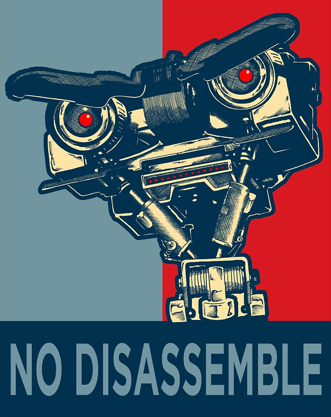

---
# Feel free to add content and custom Front Matter to this file.
# To modify the layout, see https://jekyllrb.com/docs/themes/#overriding-theme-defaults

# layout: home
layout: page
---

<!--  -->
<!--  -->

Short Circuit Racing is a Washington based racing team that has participated in
 events with various motorcycle racing organizations such as WMRRA, OMRRA, CRA,
 AFM, and more.

We have a sister team, [Short Fuse Racing](https://shortfuseracing.com)

<!--  -->

## Team

### [Chris Wilcox](https://chriswilcox.racing/)

Chris Wilcox is a regional road racer participating in [WMRRA](https://wmrra.com) (Washington Motorcycle Road Racing Association) and [OMRRA](https://omrra.com) (Oregon Motorcycle Road Racing Association), participating in Formula 600, 600 Supersport, and 600 Superbike clases.

Chris is also a long-time volunteer of WMRRA and serves on its Board of Directors. You can find him most race weekends at Friday night tech, making sure machinery and gear are in order for the weekend's events.

When not racing Chris works with [Track Time](https://tracktime.bike/), a premier track day provider in Washington State.

### Colin Carihill

### Louis Stevenson 

Louis is hard to photograph, him being the photographer and all.

